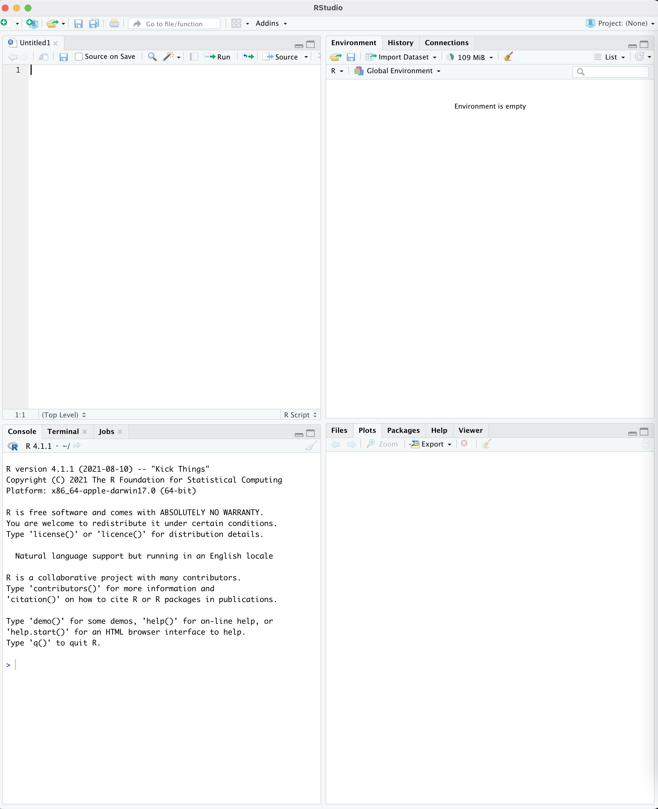
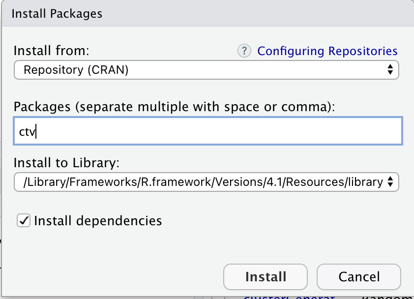
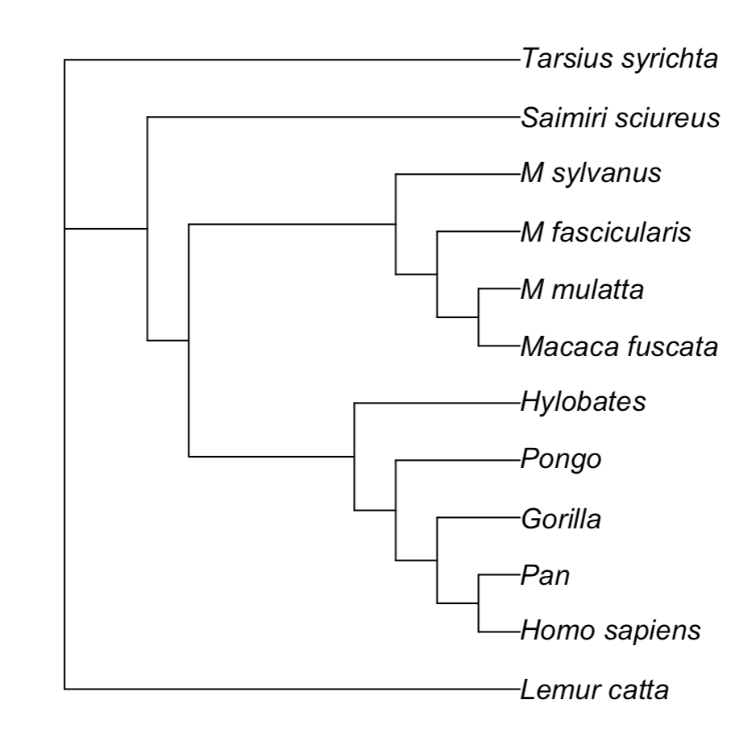

# Trees in R

BIOL6304: Phylogenetic Systematics

## Learning Objectives
By the end of this lesson, students will be able to:

1. Read in, view, and write out phylogenetic trees in R Studio
2. Use ancestral state reconstruction 


## 1. Using R Studio

R Studio is an interactive development environment (IDE) for running the R statistics and programming language. When you open R Studio you will see four windows:



Some typical uses of each window include:

- Top Left: Scripting Window, where you can write commands to run later
- Bottom Left: Console Window, where you can directly enter commands
- Top Right: Environment window, where you will see a list of information stored in memory
- Bottom Right: Plot Window, where you can see data visualizations. Also useful for Help documents and installing packages.

### Installing Packages

Although R comes with a lot of standard functions, known as "base R," many functions will need to be downloaded as Packages. Many packages in R are stored in a central repository known as CRAN, while other packages can be downloaded from a developer's website (e.g. GitHub).

You can install packages by clicking the "Packages" tab in the bottom right window in R studio, then clicking Install. **Use the window to install the package `ctv`:**



For this Phylogenetics module, we will be using the [Phylogenetics "Task View"](https://cran.r-project.org/web/views/Phylogenetics.html) which allows for a quick download of many packages useful for working with phylogenies in R. 

In the Command Window in the bottom left, enter the following command to download the phylogenetics packages:

```R
ctv::install.views("Phylogenetics", coreOnly = TRUE)
```

The installation is complete when you see a new command prompt `>` in the Console window.

### Writing Scripts

We will use the script window to write commands to run in R. This method is preferable to entering directly on the command line because you can save commands to run later, run many commands at once, and enter comments to tell your future self what it is you're running.

If you do not see the Script window in the top left, click the icon in the top left of the R Studio screen that looks like a plain paper with a + on it. Select "R Script" and a new empty window will appear.

Save this empty script in a new folder on your computer. You can call the script `phyloClass.R`

### Setting the Working Directory

We will be working with tree files and data files within R, and there is no way to load those data with a graphical interface. Instead, we will use commands to load the files. It is helpful to have the files you need all in the same directory (or folder) for easy access.

In R Studio, go to the "Session" menu and select "Set Working Directory" to "Source File Location." Using this option, R will interpret file names as located within the same folder as your new `phyloClass.R` script.

### Loading Packages

In order to have acccess to the functions within the packages you just installed, you need to load them in to memory with the `library()` function.

In your sciript window add this code:

```R
library(ape)
```

You can execute this code by highlighting it and clicking the "Run" button at the top of the screen or by pressing Ctrl-Enter (Cmd-Enter on a Mac). The command will execute in the console window in the bottom left. 


## 2. Working with Trees in `ape`

APE (Analyses of Phylogenetics and Evolution) is a package with a lot of basic functions for working with phylogenetics. It specifies the `phylo` object, which is used by many other phylogenetics programs that work with trees in R. 


### Reading in Trees

A tree can be stored in R from text or read from a file. For example, this code will store a tree of primates in a variable called `primates.tree` within R:

```R
primates.tree = read.tree(text="(Lemur_catta,((((((Homo_sapiens,Pan),Gorilla),Pongo),Hylobates),(((Macaca_fuscata,M_mulatta),M_fascicularis),M_sylvanus)),Saimiri_sciureus),Tarsius_syrichta);")
```


Alternatively, if you store the Newick tree above in a file called `primates.nwk`, you can read it in with:

```R
primates.tree = read.tree(file="primates.nwk")
```

There are several options with the `read.tree` function. You can learn more about the function by clicking on the Help tab in the bottom right and typing `read.tree` in the search box.

The tree is now stored as a `phylo` object in the variable `primates.tree`. You can view some basic statistics by just typing the variable name and hitting enter:

```
> primates.tree

Phylogenetic tree with 12 tips and 10 internal nodes.

Tip labels:
  Lemur_catta, Homo_sapiens, Pan, Gorilla, Pongo, Hylobates, ...

Unrooted; no branch lengths.
```

### Basic Tree Plotting

The `ape` package has a modification of the `plot` function that will draw a phylogenetic tree:

```
plot(primates.tree)
```



### Pruning Taxa

One of the common tools in `ape` is `drop.tip()` which allows you to drop one or more tips from the phylogeny, but keeping everything else about the tree the same.

The `drop.tip()` function has two arguments: the phylogenetic tree to work on, and the name of the tip (or tips) to drop. For example, if we wanted to drop `Homo_sapiens` from the tree, we would do:

```
> drop.tip(primates.tree,"Homo_sapiens")

Phylogenetic tree with 11 tips and 9 internal nodes.

Tip labels:
  Lemur_catta, Pan, Gorilla, Pongo, Hylobates, Macaca_fuscata, ...

Unrooted; no branch lengths.
```

In order to work with the new tree, we would need to store it in a new variable:

```
no.human.tree =  drop.tip(primates.tree,"Homo_sapiens")
```


**Exercise:** Write a command that will drop Orangutans (Pongo) from the tree and save it as a new tree `no.pongo.tree`


### Writing Trees

Trees in memory can be written out to files in a variety of formats. You can write out your new orangutanless tree using `write.tree()`:

```R
write.tree(no.pongo.tree,file="nopongo.tree")
```

Because you set the working directory, this file will be written to the same directory as your `phyloClass.R` script.


## 3. Reconstructing Ancestral States

For the remainder of this lesson, please refer to the tutorial on ancestral traits [located on the Phytools website](http://www.phytools.org/eqg2015/asr.html).


