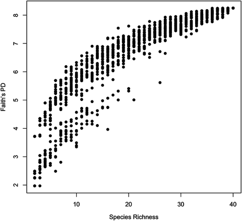

# Phylogenetics in R

#### BIOL6304 In-Class Exercises 

This tutorial gives a basic introduction to phylogenies in the R language and statistical computing environment. It has been modified from a tutorial by Liam Revell found [here](http://www.phytools.org/eqg/Exercise_3.2/).
After learning how to work with trees in R, we then use phylogenies to conduct analyses in Phylogenetic Community Ecology. These methods haveb een modified from tutorials prepared in the 2014 book "Functional and Phylogenetic Ecology" by Nathan Swenson (available from the TTU library [here](https://link.springer.com/book/10.1007/978-1-4614-9542-0)) and the 2018 book "Mixed and Phylogenetic Models" by Anthony Ives (available [here](https://leanpub.com/correlateddata) for free).


## Learning Objectives
Upon completing this tutorial, students will be able to:

- Work with (load, manipulate, plot, and write) phylogenetic trees in R


## Prerequisites
This tutorial assumes some basic knowledge of R, although many of the examples can simply be pasted into the command line within R. I recommend using [Rstudio](https://www.rstudio.com/), which provides a well organized environment for R code, the command line, and plots. RStudio is also installed on the lab computers; open it now to begin.

In this tutorial, code that you should enter into the command line within R is formatted like this:

```
print("Hello world")
rnorm(10)
2945.3877^2
```
We will be building on the skills learned in the Phylogenetics in R tutorial from last week.

### Install Packages 
Code in the R environment is organized into *packages*. Some packages are loaded by default when you start R, while others need to be specifically loaded, or installed from a central repository. Packages can be installed from the command prompt (bottom left in R Studio) or via the Install Packages tab in the plot window (bottom right in R Studio). You will need to install the following packages:

```
install.packages(c("ape","phytools","picante","geiger","vegan"))
```

`ape` does many different things, but its most important contirbution to phylogenetics is the `Phylo` object. `phytools` has a wide variety of easy to use methods for calculating phylogenetic signal as well as visualization of trees and trait evolution. `geiger` and `picante` have methods for trait evolution and phylogenetic community ecology.

One the packages are installed, you need to load them into R with the `library()` command. Enter each of these at the command prompt:

```
library(ape)
library(phytools)
library(geiger)
library(picante)
library(vegan)
``` 


## The APE Tree Object
Let's start by generating a random tree and plotting it in R studio:

```
tree <- rtree(n = 20)
plot(tree, edge.width = 2)
```
The object created in memory when we simulate or estimate a phylogeny, or read one from an input file, is a list of class `phylo`. A list is just a customizable object type that can combine different objects of different types. For instance, a list might have a vector of real numbers (with class "numeric) as its first element; and then a vector of strings (with class "character") as its second element; and so on.

An object of class `phylo` has at least 4 parts. These are normally hidden, for instance, just typing the name of your `phylo` object does not give you the structure in memory, as it does for many R objects, but if you use the `str()` function you can see the full structure:

```
tree
str(tree)
```

To get at the core of how an object of class "phylo" encodes phylogenetic, let's use a simple case: a tree with 5 tips & no edge lengths. We will use the `read.tree()` function, which can either read from a file or use a text representation of the tree (in Newick format).

```
tree <- read.tree(text = "(((A,B),(C,D)),E);")
plot(tree, type = "cladogram", edge.width = 2)
```
The tre object consists of three components: `edge`, `tip.label`, and `Nnode`

```
tree$edge
```

The matrix edge contains the beginning and ending node number for all the nodes and tips in the tree. By convention, the tips of the tree are numbered 1 through n for n tips; and the nodes are numbered n + 1 through n + m for m nodes. m = n - 1 for a fully bifurcating tree. This is just to keep track of which nodes are internal and which are leaves.

```
tree$tip.label
```

The vector tip.label contains the labels for all the tips in the tree. The order of tip.label is the order of the tips numbered 1 through n in edge.

```
tree$Nnode
```

The integer Nnode contains the number of internal nodes in the tree, including the root of the tree if the tree is rooted.

If it seems difficult to imagine that this object could contain all the information in the tree, here is a plotted tree with the edge numbers identified:

```
plot(tree, edge.width = 2, label.offset = 0.1, type = "cladogram")
nodelabels()
tiplabels()
```

We can see that all of the relationship information among the taxa in the tree is containing in the starting & ending nodes for each edge. Edges that share a common starting node number are descended from an immediate common ancestor, etc.

`phylo` can also have other components, the most common of which are edge.length (a vector of class "numeric" containing all the edge lengths of the tree in the same order as the rows in edge; and root.edge, a numeric value giving the length of the root edge, if one exists. In addition, other elements & attributes can be added for special types of phylogenetic trees.

## Reading and Writing Phylogenetic Trees

Writing a tree to a file from memory is a simple as:

```
write.tree(tree,"example.tre")
```
This writes the tree in Newick format. If instead we want to write Nexus format, we can use the `phytools` package:

```
library(phytools)
writeNexus(tree, "example.nex")
```

Reading a tree from a file into memory uses the `read.tree()` function in the `ape` package (for Newick format) or `readNexus()` in the `phytools` package (for Nexus format).

## Manipuating Trees

Some common operations we may want to do with a tree are: simulations, extracting clades, and dropping tips. Let's start with a larger tree, simiulating a tree with 40 tips using a birth-death model for the topology and branch lengths. We will also use the `plotTree` function from `phytools`, which has a lot more options than the basic `plot` from `ape`. The `set.seed` function allows for repeatability when creating the random tree:

```
set.seed(1)
tree <- pbtree(b = 1, d = 0.2, n = 40)
plotTree(tree, setEnv = TRUE)
nodelabels()
```
Using the node labels, it is possible to extract just one clade from the tree:

```
tt62 = extract.clade(tree,62)
plotTree(tt62)
```

In many applications, we may construct or use a phylogeny that has more tips than what we can use in a comparative analysis. We can drop tips from this tree by specifying a vector of tip names:

```
dt = drop.tip(tree,c("t30","t20","t24","t43"))
plotTree(dt,set.Env=TRUE)
```

As a "birth/death" tree, there are a number of tips representing extinct species. We can identify these:

```
getExtinct(tree)
```

To highlight these tips in a tree diagram, we can use the `fancyTree` function from the phytools package:

```
et <- fancyTree(tree, type = "droptip", tip = getExtinct(tree), cex = 0.7)
```


## Phylogenetic Community Ecology


### Download Data

Download the data files from the GitHub repository.

### Set Working Directory

Use the `setwd()` command to set the working directory to the location of the data files. In R Studio this can be done from the Session menu, by choosing "Set Working Directory" and then "Choose Directory..."


## Community Datasets
Data is collected from a community (or assemblage, site, sample) in a variety of ways, but using code to analyze that data requires a standardized data format. The most general format is a "site-by-species" matrix or the community data matrix. The "site" could represent a single population or an entire continent; what you must determine is what the rows and columns of the data matrix represent. In the site-by-species matrix, rows are the unique sites sampled, and there is one column for every species. The data in each cell can be presence/absence (1 or 0) or abundance data (counts of the number of organisms of a particular species at a specific site). 

The file `pa.matrix.txt` contains a small presence-absence matrix. Load it into memory:

```
pa.matrix <- read.table("pa.matrix.txt",sep=" ",header=T,row.names=1)
```

We can get basic information about the community by summing the rows and columns of the matrix. For site richness:

```
rowSums(pa.matrix)
```

Summing the columns would provide the number of sites a taxon occupies. To calculate the occupancy rate for a taxon, this value can be divided by the number of sites (rows):

```
colSums(pa.matrix)/nrow(pa.matrix)
```

The file `abund.matrix.txt` contains a site-by-species matrix with counts of individuals rather than presence-absence:

```
abund.matrix <- read.table("abund.matrix.txt",sep=" ",header=T,row.names=1)
rowSums(abund.matrix)
colSums(abund.matrix)/nrow(abund.matrix)
```

In many cases, this tidy data format is not how the data was recorded in the field. Instead, researchers may record information about each individual sampled: for example, a matrix with each individual as a row, with columns indicating the sampling site, number of individuals, and species identification. One such matrix can be found in `matrix.3col.txt`.

Data in this format must be transformed into the site-by-sample matrix. This can be done efficiently with the `readsample()` function in the `picante` package:

```
library(picante)
my.3.sample <- readsample("matrix.3col.txt")
rowSums(my.3.sample)
colSums(my.3.sample)/nrow(my.3.sample)
```

The `decostand()` function in the `vegan` package can be used to convert this data into presence/absence:

```
decostand(my.3.sample,method='pa',MARGIN=1)
```
Here we used the `pa` method, which converts to presence/absence. Other methods for converting the data are available, including `total` (for relative abundance) and `rank` (for rank abundance). Find out more about the function using `?decostand`.

## Phylogenetic Diversity

As we saw in lecture, interpretations of presence/absence and abundance data in a community may be different if we account for the phylogenetic relatedness of taxa. One of the most common ways to assess phylogenetic diversity of a community is with Faith's Phylogenetic Diversity (PD). The metric uses the sum of all branch lengths of a phylogenetic tree containing only the taxa in a community. 

The file `PD.example.sample.txt` contains abundance data for fifteen species in five communities:

```
my.sample = read.table("PD.example.sample.txt",sep="\t",row.names=1,header=T)
```

The file `PD.example.phylo.txt` contains a rooted, ultrametric, phylogenetic tree with branch lengths, stored in Newick format. We will read this file in using the same methods in the `ape` package as last week:

```
my.phylo = read.tree("PD.example.phylo.txt")
plot(my.phylo)
```

### Manipulating Data

To calculate Faith's PD for a single community, we must produce a data vector that contains only the data for that community, and reduce the phylogeny to only the taxa that are in that same community. First, subsample the data matrix to only include information on the first community, and remove all species with zero abundance. The length of this vector is the species richness.

```
com.1.abund = my.sample[1,my.sample[1, ] > 0]
length(com.1.abund)
```

To get the PD of this community, the phylogeny must be reduced to have only the taxa in the community, which we can do using the column names of the community-specific vector and the . 

```
com.1.phylo = keep.tip(my.phylo,colnames(com.1.abund))
plot(com1.phylo)
```

**NOTE**: for older versions of `ape`, the `keep.tip()` function is not available. Instead, you must first determine the species to drop by comparing the vector to the tip labels of the phylogeny, and then use `drop.tip()`:

```
tips.to.drop = setdiff(my.phylo$tip.label,colnames(com.1.abund))
com.1.phylo = drop.tip(my.phylo,tips.to.drop)
plot(com.1.phylo)
```

Faith's Phylogenetic Diversity can be calculated using the pruned phylogenetic tree by summing hte branch lengths:

```
sum(com.1.phylo$edge.length)
```

### Creating a Function

To calculate this for all communities, we can put the above into a function and use `apply()` to quickly calculate Faith's PD for all columns of the original matrix.

```
faith.pd = function(x) {
  tmp.com = names(x[x>0])
  tmp.tree = keep.tip(my.phylo, tmp.com)
  sum(tmp.tree$edge.length)
}
```

The function takes a single vector `x`, which is a row from the community matrix. The `apply()` function is used across the rows:

```
apply(my.sample,MARGIN=1,faith.pd)
```

### Visualizing Abundance Data

We can visualize the abundance data by treating it as trait data and plotting it along with the phylogeny. Most phylogenetic packages in R treat trait data as a matrix where species are in rows and observations (traits) are in columns. Therefore, we will have to transpose the `my.sample` matrix:

```
my.traits = t(my.sample)
```

The `dotTree()` function in the `phytools` package is a handy way to show the abundance data:

```
library(phytools)
dotTree(my.phylo,my.traits)
```

There is frequently a wide variance in abundance data, so it is frequently transformed for easier visualization. This can also be done in the `dotTree()` function, which transforms the abundance data within each community to have the same mean and variance:

```
dotTree(my.phylo,my.traits,standardize=T)
```

## Distance Based Phylogenetic Diversity

Many of the metrics developed to measure phylogenetic diversity rely not on the total length of the phylogenetic tree, but on the distance between members of a community. These are broadly characterized into *pairwise* metrics, in which the distance between every pair of species is calculated and *nearest neighbor* metrics, which use the distance between every species and its closest relative in the community. Both types of metrics begin with the calculation of a distance matrix, which can be done with the `cophenetic()` function in the `stats` package:

```
dist.mat = cophenetic(my.phylo)
dist.mat
```

### Pairwise Metrics

The distance matrix is used internally by a number of functions in the `picante` package:

- `psv`: Phylogenetic species variability quantifies how phylogenetic relatedness decreases the variance of a neutral trait shared by all species in a community.
- `psr`: Phylogenetic species richness is the number of species in a sample multiplied by `psv`, and is a measure of the species richness discounting species relatedness.
- `pse`: Phylogenetic species evenness takes into account relative species abundances. The maximum value of `1.0` is attainable only if species abundances are equal and the species phylogeny is unresolved (a star).

```
psv(my.sample,my.phylo)
pse(my.sample,my.phylo)
psr(my.sample,my.phylo)
```

How does the phylogenetic species richness compare to the raw species richness? Do the rankings of diversity within the communities change depending on the metric?

### Nearest Neighbor Metrics

Pairwise distances can sometimes leave out important information about the relatedness among terminal taxa in the community. For example, a community may have pairs of related species from distantly related genera-- this community would be seen to have high phylogenetic diversity and pairwise distance, but the information about related terminal taxa would not be incorporated. Instead, we can calculate the *Mean Nearest Taxon Distance* (MNTD). Let's build a function for calculating MNTD by first working with sa single community as before:

```
com.2.abund = my.sample[2,]
com.2.names = names(com.2.abund)[which(com.2.abund>0)]
```

We will need to reduce the distance matrix to only the species from this community. We will also set the diagonals of the matrix to `NA` rather than `0` so that "distance to self" will not affect our calculation of nearest neighbor:

```
com.2.dist = dist.mat[com.2.names,com.2.names]
diag(com.2.dist) = NA
com.2.dist
```
Next we will calculate the minimum value in each row of the distance matrix (nearest taxon distance). The mean of this vector is the MNTD.

```
com.2.ntd=apply(com.2.dist,MARGIN=1,min,na.rm=T)
com.2.ntd
mean(com.2.ntd)
```

We can put this together into a function as before:

```
my.mntd = function(x){
	com.names = names(x[x>0)
	my.com.dist = dist.mat[com.names,com.names]
	diag(my.com.dist) = NA
	mean(apply(my.com.dist,MARGIN=1,min,na.rm=T))
	}
```

Now we can apply this function to all communities:

```
apply(my.sample,MARGIN=1,my.mntd)
```
How does the MNTD differ from the pairwise-distance based metrics?

### Abundance Weighted Metrics
The function we wrote above only takes the presence or absence of taxa into account, and not the abundances. Adding abundance information can provide additional insight. For example, we could draw different conclusins about the diversity of a community if two related species had very different abundances, compaerd with a community where those two species had equal abundance.


A version of the MNTD function exists in the `picante` package that can account for the abundances:

```
mntd(my.sample,dist.mat,abundance.weighted=T)
```

Does using species abundances change the ranking of diversity of the five communities?


## Phylogenetic Beta Diversity

In ecology, three measures of community diversity are often defined:

- Alpha diversity: The species richness of a community
- Gamma diversity: The total species richness in a landscape
- Beta diversity: The proportion of species richness that comes from differences among communities.

We have already seen the effect of using phylognetic diversity on calculating alpha diversity; here we will explore the relationships among communties while incorporating phylogenetic information.

### UniFrac

The UniFrac metric compares two communities by computing the fraction of the phylogeny that is unique to each community and comparing this to the fraction that is shared by the two communities. It therefore requires calculating three values of Faith's PD:

- The PD of species in community A but not community B
- The PD of species in community B but not community A
- The PD of species in both community A and community B

The data we will use for this section is in two files: `beta.example.sample.txt` and `beta.example.phylo.txt`. Read in these files:

```
beta.sample = read.table("beta.example.sample.txt",sep="\t",row.names=1,header=T)
beta.phylo = read.tree("beta.example.phylo.txt")
```

Next, use the `unifrac()` function in the `picante` package:

```
unifrac(beta.sample,beta.phylo)
```

This returns a unifrac distance matrix comparing all communities. One way to visualize this is with a heirarchical distance tree:

```
plot(hclust(unifrac(beta.sample,beta.phylo))
```

As with the alpha diversity metrics above, we can also use abundances to return a weighted version of the UniFrac metric. One method is the `GUniFrac()` function in the `GUniFrac` package.

```
library(GUnifrac)
GUniFrac(beta.sample,beta.phylo)
```
The function returns several distance matrices, which are calculating using different values of `alpha`, which represents how much to weight the abundances when calculating `UniFrac`. To plot the distance matrix as before, using the weighted UniFrac (You can also plot the versions that have different values of alpha using `d_0.5` or `d_0` in place of `d_1`.):

```
my.gunifrac = GUniFrac(beta.sample,beta.phylo)
weighted.unifrac = as.dist(my.gunifrac$unifracs[,,"d_1"])
plot(hclust(weighted.unifrac)
```

Do the communties change relationships when accounting for abudances?

## Null Models

In all of the examples above, multiple communities are being compared to each other. Frequently, researchers may compare raw species richness (SR) or beta diversity metrics with those that incorporate phylogenetic relatedness. However, species richness and phylogenetic diversity (PD) are strongly correlated, as seen in this graph plotting PD versus SR for a large community dataset:

 

Not only are PD and SR correlated, but the variance in PD is higher when SR in a community is low. It is therefore not usually possible to use regression to calculate the contribution of PD to the community assemblage. As a result, it is better statistical practice to incorporate null models to assess significance of results. The null models permit a calculation of *Effect Size* by comparing the observed PD to those expected under the null model.

In one class of null models, metrics calculated from observed data (the species-by-site matrix) are compared to the same metric calculated from a randomized matrix. Alternatively, the phylogenetic data can be randomized.

In this section, we will be working with the files `null.example.sample.txt` and `null.example.phylo.txt`.

```
null.sample = read.table("null.example.sample.txt",sep="\t",row.names=1,header=T)
null.phylo = read.tree("null.example.phylo.txt")
```

Use the functions we learned before to calculate the phylogenetic diversity of this dataset:

```
pd.observed = pd(null.sample,null.phylo)
psv.observed = psv(null.sample,null.phylo)
```

### Randomize Community Data

Next we will create 100 random rearrangements of the dataset using the `randomizeMatrix()` function in the `picante` package. The `null.model` we will use is `independentswap`, which reduces Type I error rates by making sure the sums of the rows and columns remain constant:
```
null.reps = replicate(100,randomizeMatrix(null.sample,null.model="independentswap"),simplify=FALSE)
```

This returns a list, so we can then use the `lapply()` function to calculate our statistics across the replicates:

```
pd.null = lapply(null.reps,pd,tree=null.phylo)
psv.null = lapply(null.reps,psv,tree=null.phylo)
```
Let's compare the phylogenetic diversity of the first community to the distributed generated via randomization. We use a function defined within `lapply()` to indicate we want to retrieve the `pd` value (first column) for the first community (first row). This is specified by `[1,1]`. 

```
com.1.pd.null = as.numeric(lapply(pd.null,function(x) x[1,1])
stripchart(com.1.pd.null,method='stack')
abline(v=pd(null.sample,null.phylo)[1,1],col='red')
```
Try this again with the other communities. Do all of the communities have significant phylogenetic diversity? (To get information from the second community, use `[2,1]`.)

### Randomize Phylogeny

Alternatively, the phylogenetic distances may be randomized by permuting the names of terminal taxa on the phylogeny. This can be accomplished by using the `tipShuffle()` function in the `picante` package:

```
random.phylo = tipShuffle(null.phylo)
```

Use `plot()` to view both `random.phylo` and `null.phylo` to confirm that the tip labels have been shuffled, while the phylogeny remains otherwise unchanged (branch lengths and toplology):

```
par(mfrow=c(1,2))
plot(null.phylo,main="Original Phylogeny")
plot(random.phylo,main="Shuffled Phylogeny")
par(mfrow=c(1,1))
```

We can use `replicate()` to create a large number of these, and then use `lapply()` to calculate phylogenetic diversity on each randomized tree:

```
random.phylo = replicate(100,tipShuffle(null.phylo),simplify=F)
random.phylo.pd = lapply(random.phylo,pd,samp=null.sample)
com.1.phylo.pd = as.numeric(lapply(random.phylo.pd,function(x) x[1,1]))
stripchart(com.1.phylo.pd,method='stack')
abline(v=observed.pd[1,1],col='red')
```

The visualization is interesting, but to actually calculate a p-value, we need to identify the rank of the observed value among the estimates from the null distribution. This rank divided by the number of replicates is the P-value for the randomization:

```
rank(c(pd.observed[1,1],com.1.pd.null))[1]
```

Is the observed PD signifcant? Repeat the above for one of the other communities (for example, use `[2,1]` for the second community in the previous two code blocks).


