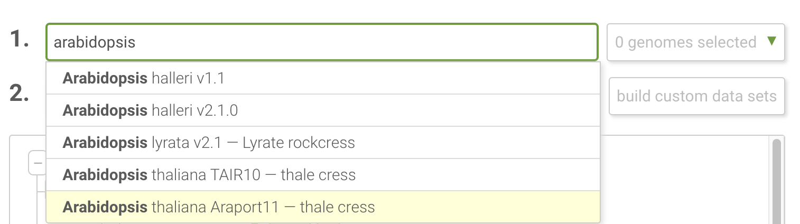
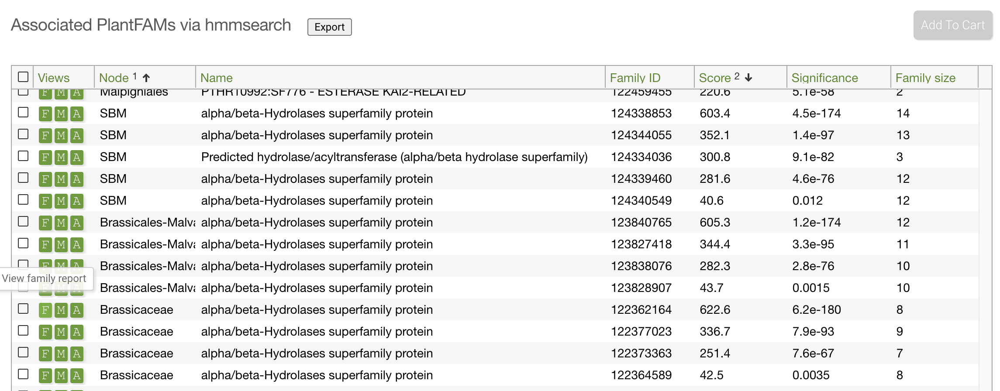
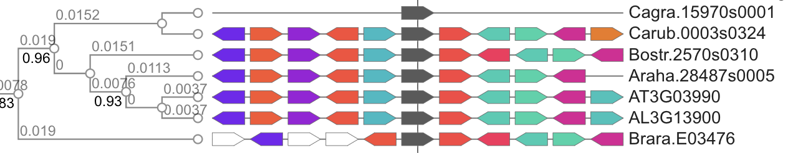

# Phylogenomics

BIOL6304 Week 12

### Learning Objectives

After completing this activity, students should be able to:

- Download genomic data from 
- Read and interpret gene family phylogenies

## Exploring Gene Evolution on Phytozome

We will be using the Phytozome website to download data from published and in-progress plant genomes. Phytozome is maintained by the Joint Genome Institute (JGI) at the US Department of Energy.

Follow this link to get to Phytozome: [https://phytozome-next.jgi.doe.gov/](https://phytozome-next.jgi.doe.gov/).

To the right you will see a list of plant species for which genomes are available on Phytozome. Each genome has some information next to it regarding its use restrictions **UNRST** means the genome is free to use in any form, but **RST** means that the genome can be used for individual analyses but full genome analysis including this assembly is restricted to just the authors. This is part of an agreement known as the [Fort Lauderdale Accord](https://www.genome.gov/Pages/Research/WellcomeReport0303.pdf), in which the biomedical and genomics community agreed to provide genomic data pre-publication, while retaining the rights to full-genome publication to the authors who funded the genome project. The analysis in this class will only be at single genes, and is for education purposes, so we are free to use all of the data.

In the panel on the right, we first need to select a genome of interest. We will use *Arabidopsis thaliana*, the first plant genome sequenced and the most widely studied model organism in land plants.

In the search bar, start typing `Arabidopsis thaliana` and select the `Araport11` assembly. 

We will be searching for a gene that has multiple copies in plants, *KAI2*, otherwise known as Karrakin Insensitive 2. This gene is what causes seeds to respond to smoke to induce germination in fire-prone ecosystems.

Click Find Genes by Keyword and type: `KAI2` and search. On the next page you will see a report of the matches. Click the green `G` to investigate the gene further. On the next page you will see a lot of information about the gene, its protein product, its location in the genome, and expression levels in *A. thaliana*. We will be downloading orthologous sequences that Phytozome has identified in other species.

Scroll down to the box labeled `Associated PlantFAMs via hmmsearch`. In this box, scroll down until you see the Brassicaceae (the family that *Arabidopsis* belongs to). Click the green `F` next to one of the gene families to view a comparative genomic and phylogenetic view of this gene family in Brassicacae.

On this page you will see the organisms and geneIDs listed and a phylogenetic tree listed. If you compare the IDs of the the genes to the organism names, you can see that there is only one copy of this gene in Brassicacae.

The phylogenetic tree also uses colored flags to represent **synteny** or the order of genes along the chromosome. The KAI2 gene is in the middle for each species in dark gray. Hover over the other genes for *Arabidopsis thaliana*. Now look at the order of genes in the related species of Brassicacae. Is the gene order conserved?

### Exercise: AUX1

In contrast, another gene family that has seen some more expansion is the Auxin gene family, responsible for growth and development of plants. [Click this link to find the gene family report](https://phytozome-next.jgi.doe.gov/report/family/5272/122794866) for one Auxin family in the eudicot angiosperms.

### Questions

1. How many copies of the Auxin gene are in *Arabidopsis thaliana* (hint, the gene names begin with `AT`).
2. In which species related to *A. thaliana* are duplicate copies found? 
3. Can you determine the common ancestor in which the duplications occurred? (hint: the higher-level classifications can be found on the Phytozome main page).
4. Are the genes flanking the AT sequences the same in related species?

