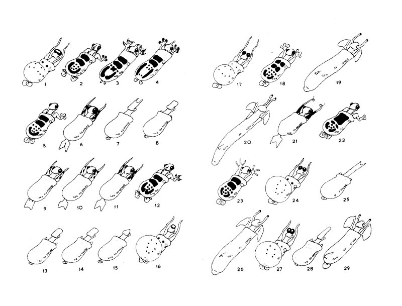

# Scoring Morphology

### BIOL6304: Principles and Practice of Phylogenetics

In-Class Exercise

## Learning Objectives
After completing this activity, students will be able to:

- Identify characters with primary homology in a set of (artificial) organisms.
- Use systematic principles to construct a character matrix for use in phylogenetic inference. 
- Construct systematic hypotheses based on character similarity.

## Using Cartoon Taxa

In this exercise you will choose between two sets of cartoon taxa developed to help students develop skills in phylogenetic systematics: the Caminalcules and the Dendrogrammaceae

The Caminalcules were first described by Camin and Sokal in 1965, for use in systematics classes. They first appeared in print by [Sokal in 1983](https://www.jstor.org/stable/2413279). Here, we will work with images of 29 extant taxa.

The Dendrogrammaceae was introduced in [1980 by Duncan, Philipps, and Wagner](https://www.jstor.org/stable/pdf/2418373.pdf) and provides a more botanical alternative to the Caminalcules. In contrast to the Caminalcules, for which the "true phylogeny" is not known, the Dendogrammaceae were specifically "evolved" along a known phylogeny. The Dendrogrammaceae [received an update in 2018 by Lynn Clark](https://botanydepot.com/2020/03/11/dendrogrammaceae-a-hypothetical-family/), who added colors and an outgroup. 

Your task is to begin a systematic study of either the Caminalcules or the Dendrogrammaceae.We will make some assumptions about the two fake groups that are not true for all systematics projects:

- All the taxa are correctly identified.
- The characters are not variable within taxa.
- There is no phenotypic plasticity; all characters are heritable

## In-Class Assignment
Your task is to identify 15 characters that differentiate the Caminacules or Dendrogrammaceae based on the drawings at the end of this document. Use an Excel spreadsheet to record your character matrix. The taxa should be in rows, and the characters should be in columns.

Keep notes about how you are classifying each character and character state. You will use your data matrix next week to infer a phylogeny of the taxa using maximum parsimony. The character matrix and phylogeny will be part of your short paper, due September 29.

## On Homology

A phylogeny can only be built with homologous characters. When constructing a morphological character matrix, you should keep mind the three main principles of primary homology:
-  Correspondence in position and details in structure 
-  Correspondence in developmental origin
- Evolutionary series of character states

Since we do not have information about the developmental stages of the Caminalcules, we will have to assume that positional similarity reflects homology. It may be useful to first sort the Caminalcules into “genera” based on overall similarity in appearance.

## Choosing characters
Systematists rely on expertise with a group of organisms to identify and score morphological characters. Here are some guidelines to help you make decisions about your character matrix.

**Use numbers for character states** Rather than code the character states directly in the matrix, use numerical codes. This will make the task of inferring the phylogeny next week much easier. Keep good notes on what each character state means!

**Avoid autapomorphies**. A character that is present in only one taxon is not informative for phylogenetic inference via parsimony. At least two taxa should share a character state.

**More characters is better than more character states**. Next week, you will be tasked with inferring a phylogeny of the cartoon taxa using your matrix. As part of that exercise you will need to decide on a model of evolution for the characters. It will be easier to set the model for each character if there are fewer character states. If you find yourself coding a character with more than four character states, consider whether it can be split into separate characters. In addition, having more characters will increase the chances the phylogeny you reconstruct will be supported.

**Missing data is OK**. Some characters may be entirely missing in some taxa. If you are using the character leg color, you may code 1 for red and 2 for green, and for organisms lacking legs, you can use 0.

## The Caminacules

## The Dendrogrammaceae

