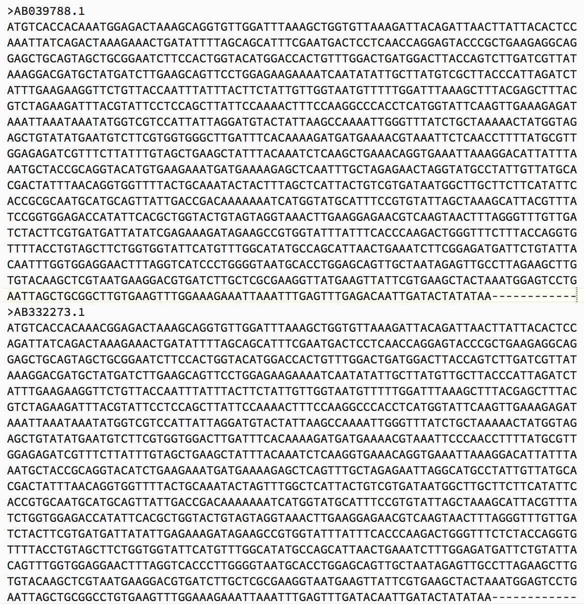
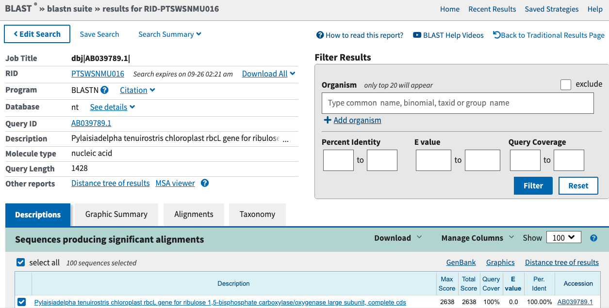
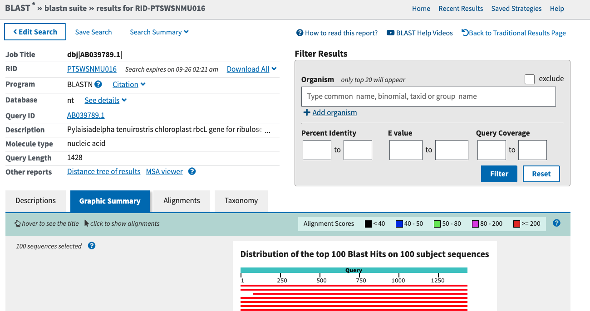
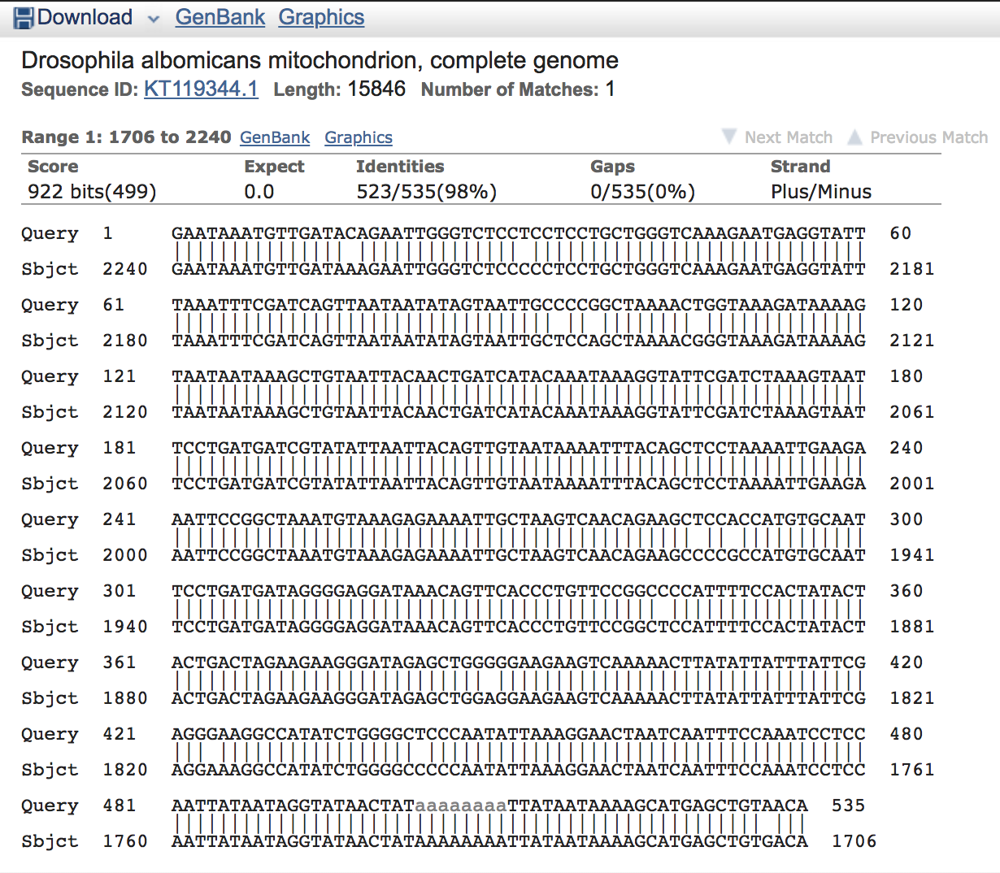
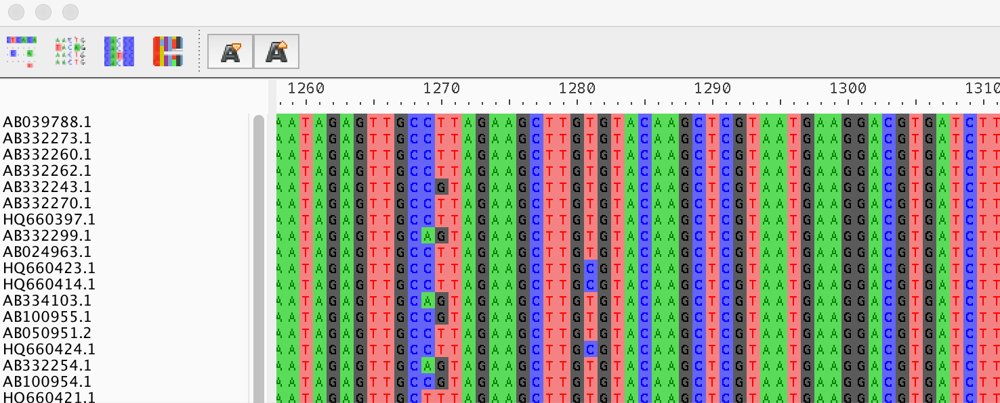
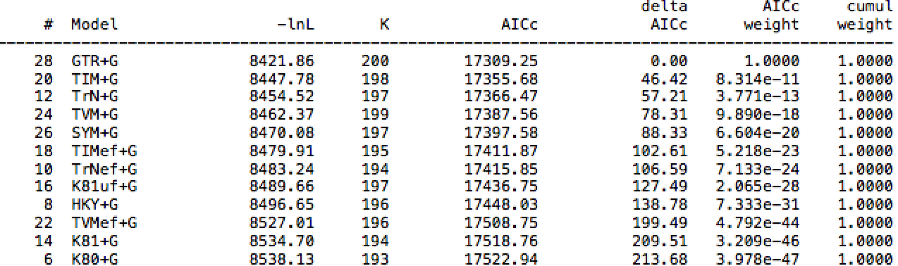

# Inferring Phylogenies with Likelihood
BIOL6304: Principles and Practice of Phylogenetics

## Learning Objectives

After completing this activity, students will be able to:
- Retrieve DNA sequence data from an online database.
- Infer a multiple-sequence alignment.
Compare models of molecular evolution on a DNA character matrix. 
- Infer a phylogeny using the maximum likelihood critereon.

## Software 

Install Aliview from here:  https://ormbunkar.se/aliview/

## Introduction
Over the last few lectures, we have learned the process of inferring phylogenies from molecular sequence data. One main advantage of molecular sequence data is the ability to model evolution, based on observed patterns of substitution in DNA or protein sequences. Molecular character ma- trices are often much larger than morphological matrices, allowing for better measures of phylogeny support.
Constructing a molecular character matrix means acquiring sequence data in some way, either through traditional Sanger sequencing of individual loci, whole genome or transcriptome sequence, or one of the reduced representation methods such as target capture or amplicon sequencing. Unfor- tunately the budget for this course is a bit low, so we will be using another common way to acquire sequence data: mining large databases for other people’s sequences.

## Searching for Sequences in GenBank

The National Center for Biotechnology Information (NCBI) is maintained by the National Institute of Health (NIH) for the purpose of handling computerized versions of biological data. One repository, GenBank, is a database of biological sequence data, compiled by researchers who submit sequences to the database. Since the mid-2000s, many journals require that sequence information associated with peer-reviewed articles be deposited in databases like GenBank as a condition of publication. As of 2018, GenBank contains over 200 million sequences consisting of over 200 billion nucleotide bases. Each sequence is a database record that includes metadata about the sequence, including organism identity, origin, and publications associated with the sequence.

Go to: https://www.ncbi.nlm.nih.gov/nuccore/ In the search bar, enter the sequence `KR081510.1`. Take some time to read through the information presented. What is the name of the gene that was sequenced? Is the whole gene sequenced, or only part of the gene? What kind of sequencing tech- nology was used?

At the top of the screen underneath the sequence name and GenBank accession number, there is a link labeled `FASTA`. Click this link to view the full sequence in a common format. The FASTA format is relatively simple: the first line is the sequence identifier (ID), and always starts with `>`. All lines that follow the sequence identifier are interpreted as sequence information, until the next line that starts with `>`. This way, the FASTA format can hold multiple sequences, and the sequence information can be on multiple lines to improve readability.



## The BLAST search

Another way to search the NCBI database is to submit a query using a known sequence, and identify other similar sequences. The algorithm used for this search is known as BLAST: Basic Local Algorithm Search Tool. BLAST works by comparing the pairwise similarity of *query* sequences, submitted by the user, to subject sequences – stored in the database. One or more query sequences are submitted ot be compared against the database. We will be constructing two character matrices – one with a protein-coding gene, and another with non-coding DNA.

### Exercise

Within GenBank, search for a sequence of one of the following protein-coding genes:

**rbcL** aka Rubisco: a commonly used chloroplast gene for plants.

**cox1** aka cytochrome oxidase: a commonly used mitochonrdiral gene for animals.


You may also add a group of organisms (i.e. mosses) to the search. Click on one sequence to view its GenBank record. On the top-left of the screen is the command Run Blast, which will take you to the BLAST website.

Along the top you will see several tabs that indicate which kind of BLAST search you will make; your sequence is nucleotide, and we want to search a nucleotide database, so we will use blastn. Your GenBank accession number will be in Enter Query Sequence box. A full sequence can also be entered using the FASTA format.

Take a moment to look over the options for the blastn search below. Which database is selected? Which organisms will be searched? Which BLAST program is selected? Click the blue question mark to reveal more details about these selections.
Click on the BLAST button to start the search. When the search is finished you will see a screen like the one below:



You can also click on the Graphic Summary tab, which will show something like this:



The graphical representation shows a number of BLAST hits (colored lines) and how much of the query sequence matched the subject sequence. The color of the lines corresponds to the BLAST score of the pairwise alignment between the query and subject. Below the graphic is a list of sequences and the BLAST scores. Clicking on one of these sequence names will take you to a graphical representation of the alignment between the sequences. Since we searched using a sequence already in the database, the first result is likely to be that sequence itself. Click on one of the other sequences to view the alignment, which might look something like this:




All exact matches are indicated by lines between the query and subject sequence. Mismatches have no line, and may be either a substitution (i.e. A vs T) or an insertion/deletion mutation (indel, represented by - characters) Take note of the numbers indicated to the left of the alignments. These represent the coordinates of the pairwise alignment relative to the start of the query and subject sequences. In the example above, the subject sequence comes from a whole mitrochondrial genome, which explains why the coordinates are so large.

### Exercise
Move back to the top of the blast window, below the graphic to the list of BLAST results. To download the sequences, check the box next to at least 25 sequences from these results. Once you have selected sequences, select `Download` and save the file in FASTA format.

## Viewing Sequences in AliView

The FASTA sequence file is a plain text file that can be opened in any editor, such as Notepad++ or BBEdit. However, a sequence alignment viewer is more useful for multiple sequences. Open the AliView program, and then open one of your FASTA files. The four bases of DNA are color-coded within the program. You can change the size of the bases in the toolbar at the top of the screen. Scroll left and right to view the whole sequence. Do your sequences appear aligned? Are some sequences more aligned than others? Do all the sequences start and end at the same point?



The sequences in your file are unaligned. Although each sequence was aligned to your query sequence in the BLAST search, this was only a pairwise alignment. Each of the subject sequences are not aligned to each other. To conduct a proper phylogeny reconstruction, we need to conduct a multiple sequence alignment.

## Multiple Sequence Alignment in MAFFT

One of the most popular types of multiple sequence alignment is the progressive alignment method. The procedure is to create a distance matrix from the unaligned sequences, and compute a distance tree (usually with the UPGMA method). The alignment of characters is then adjusted to minimize the distance on this tree. The UPGMA tree is also rearranged to reveal any additional ways to minimize the distance. Overall, the process is intended to find an alignment with the shortest associated tree, with the rationale that many characters will not be variable, and the alignment with the shortest distance will have these characters aligned.

The most important concept in the alignment process is the treatment of gap characters. When sequences cannot be perfectly aligned, gap characters must be inserted to improve the alignment. Programs usually have two parameters that affect gap characters within the program: one that controls the insertion of the first gap in an otherwise contiguous sequence (gap opening penalty), and another parameter that extends a gap once present (gap extension penalty).

[MAFFT](https://mafft.cbrc.jp/alignment/software/) is a popular program for multiple sequence alignment that has been found to be both fast and accurate with many sequences. Other progressive alignment methods include CLUSTALW and T-COFFEE.

### Exercise
Navigate [to the MAFFT website](https://mafft.cbrc.jp/alignment/software/), and select the Online Version option in the left sidebar. In the Input section, use the option to upload one of your FASTA files. In the next section, select the option to have the characters returned in the same case as the input. The advanced settings control the search strategy, including the gap opening penalty, but for now we will leave the settings as default.

You may enter your e-mail address, but with the number of sequences we’re using, the alignment should only take a few seconds. Click submit and wait for your results.

Download the completed alignment file in FASTA format, and open it in AliView. How different is the alignment from MAFFT from the original unaligned sequences? How much longer is the MAFFT alignment? Were many gaps inserted?

## Sequence alignment of coding sequences using MACSE

Your gene is a sequence from a protein-encoding region of the genome. Protein coding genes are expected to evolve in a certain pattern that is different from non-coding regions. For example, we learned in lecture that the first and second position of each codon are likely to evolve much more slowly than the third codon position. We may also expect that certain types of amino acid substitutions in the protein translation are more likely than other amino acid substitutions.
We want to take advantage of this information when we build the alignment and, later, when we infer the phylogeny.

MACSE is a program that uses information about the protein translation of the nucleotide sequences to inform the alignment. The resulting alignment is in frame, that is, the first position of the alignment corresponds to the first position in the first codon, and every three bases corresponds to one codon. There is also an online server to infer alignments with [MACSE at this link](https://mbb.univ-montp2.fr/MBB/subsection/softExec.php?soft=macse2).

### Exercise

Go to the MACSE website and load your FASTA file from your protein-coding sequences into the Sequences section. MACSE takes a bit longer, so it may be a good idea to add your At the bottom of the screen you can re-name the names of the output files. Run MACSE, and download the two output files in FASTA format.

Open the NT file in Aliview. Do you notice any differences between this alignment and the MAFFT alignment for the same gene? The color scheme may be different. This is because MACSE can infer frameshift mutations that are represented by exclamation points. Use the search bar to find all exclamation points (!), and replace these with hyphens (-).

## Inferring Molecular Phylogenies in PAUP

Now that you have constructed molecular sequence alignments, it is time to infer phylogenies from those alignments. Each alignment needs to be converted to the NEXUS format to be used in PAUP. This can be done within AliView in the File menu. For the MAFFT alignments, use the `Save as Nexus` option, but use the `Save as NEXUS codonpos` for the MACSE alignment. Open one of the alignments in PAUP and execute the file (Ctrl-R in the graphical version).

### Determining the best molecular model

Last week we explored different molecular models and how to evaluate which one is a better fit given our data. Sneakily, I did not tell you about an automated method for this that can be completed in PAUP!

First, get a tree by simply typing `nj` into the command window and hitting enter.

Next, switch PAUP into likelihood mode in the Analysis menu. Choose the Automated Model Selection option in the Analysis menu. To make the options easier, select only the AICc under criteria, and under Models for among-site variation, select only Equal sites and gamma. Click OK to start the analysis.

**COMMAND LINE VERSION**
First, make sure the likelihood criterion is set: `set criterion=likelihood`

Then, run the ModelTest:
`autoModel AIC=no BIC=no invarSites=no IplusG=no lset=AICc`


PAUP will evaluate each model in order of simplest to most complex. In the table that is output to the screen, note the likelihood score -lnL which means the negative log-likelihood score. Closer to zero is better. The number of parameters associated with the substitution model or total (including branch lengths) is also listed. The AICc score represents the likelihood adjusted by the number of parameters. Which model has the highest number of parameters? Does this model also have the best (lowest) likelihood score?



### Conducting a Likelihood Search in PAUP

PAUP will automatically store these parameters to be used in a likelihood search. Begin a search using "Heuristic search" in the Analysis menu. To avoid getting stuck in local optima, we will use 10 different starting trees. Go to the "Stepwise addition" tab and select "random."

**COMMAND LINE VERSION** `hsearch addSeq=random`

This command may take some time. When it is complete, save the maximum likelihood tree to a file.

### Exercise
We will now repeat the analysis but with the alignment from MACSE. If you open the NEXUS file for the MACSE alignment in a text editor, you will notice it has an extra block called SETS. This specifies a partition of the data so that the first, second, and third positions of every codon can be analyzied separately, with a separate transition matrix for each partition.

To activate partitioning by codong position, you will need to specify a character partition scheme in the NEXUS file. Add the following to your MACSE NEXUS file:

```
begin paup;
charpartition codon= 1:1st, 2:2nd, 3:3nd; 
end;
```
Save the file and executute it in PAUP. In the Likelihood Settings, find the Across-Site Rates tab, and under Site-specific rates, choose the `codon` partition. Repeat the heuristic search, and save the maximum likelihood tree.

In some analyses, it is prudent to completely exclude the third codon position from the analysis, due to concerns of homoplaisy. To exclude an entire set of characters, you can choose Include/Ex- clude characters from the Data menu. Use the drop-down menus to move the 3rd codon position to the Exclude side. Repeat the heuristic search again and save the tree.


**COMMAND LINE VERSION** 

Before re-running the search, use: `lset siteRates=partition:codon`

To exclude the 3rd codon position, use: `exclude 3nd`.


### Exercise

In FigTree, compare your three trees. What is the difference between the MAFFT alignment and the MACSE alignment. For the MACSE alignment, did removing the 3rd codon positions make a difference?
