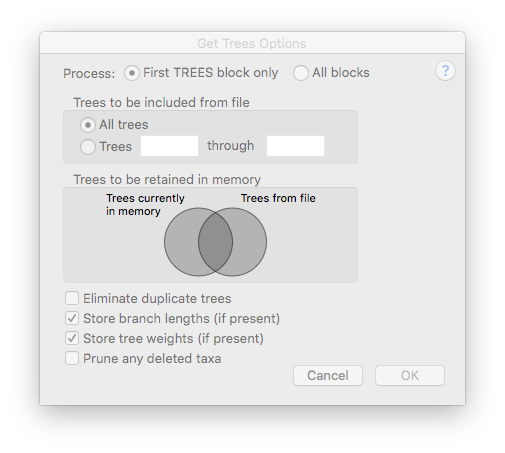

# Tree Support and Hypothesis Testing

** BIOL 6304: Principles and Practice of Phylogenetics **

## Learning Objectives

After completing this activity, students will be able to:

1. Calculate the non-parametric bootstrap support for a phylogenetic inference. 
2. Conduct hypothesis tests of tree topology using three common methods.
3. Use a constraint tree to test a specific hypothesis.

## Introduction

One of the major advantages of the maximum likelihood criterion for inferring phylogenies is the ability to use different statistical tests to calculate support for a phylogenetic hypothesis. The nonparametric bootstrap is one of the most common methods for inferring support (and is not unique to the ML method, it can also be used with maximum parsimony).

Topology tests take advantage of the likelihood scores generated under different scenarios to compare phylogenetic hypotheses. Care must be taken not to violate the assumptions of these tests, which are highly sensitive to false positives and negatives.

## Bootstrap in PAUP

Open the `primates.nex` file in PAUP and execute the file (Ctrl-R). 
To conduct a bootstrap analysis, first ensure that the likelihood settings are activated in the Analysis menu. 
Then, choose Bootstrap/Jackknife from the analysis menu. 
Change the number of replicates to 200, and select the options to do a full heuristic search and to retain all groups compatible with 50% majority-rule consensus. 
Also select to save the trees to a file (we will use these trees in a later exercise).
Click continue, and you will be presented with the heuristic search options. Leave these as defaults and start the search.
When the search completes, the majority-rule consensus will be printed along with a record of all bipartitions found in the bootstrap trees. 
The bipartition table uses asterisks to identify which groups are together on a tree. 
The order of taxa in the columns of the bipartition table is the same as the order in the original matrix.

**COMMAND LINE VERSION**

First, execute the NEXUS file: `execute primates.nex`

Set the optimality criterion to likelihood: `set criterion=likelihood`

Run 200 bootstrap replicates with a heuristic, saving the bootstrap trees to a file: 
`bootstrap nreps=200 treefile=boot.tre search=heuristic/ addseq=random;`

### Questions

* Which groups in the primate tree are maximally supported (100%)?
* For groups with less than maximal support, which ones would you consider highly supported?
* Using the bipartition table (with the asterisks) identify which grouping(s) is/are alternative bipartitions found in the bootstrap trees?
* Open the `boot.tre` file in FigTree. Can you find trees that disagree with the majority rule consensus? What bipartitions make those trees different?

## Testing Trees

When conducting a maximum likelihood search, it is common to wonder whether the maximum likelihood tree is significantly better than other possible topologies. Three common topology testing methods are the KH test, the SH test, and the AU test. These test differ in their null hypothesis and the method for overcoming bias, as noted in lecture:

**The Kishino-Hasegawa (KH) Test** compares two trees by calculating the support for each tree from the character matrix, and identifying whether the support is significantly greater than a random sampling. Under the null hypothesis, the proportion of sites supporting each tree are expected to be roughly be roughly equal. To be statistially valid, trees in KH tests should be selected *a priori*. 

Most applications of topology tests are done *a posteriori* (after the phylogenetic analysis, so the KH test assumptions are violated, resulting in too many false positives. **The Shimadoaira-Hasegawa (SH) Test** contains a correction for this bias by using a likelihood ratio test and a resampling procedure to generate a proper null distribution. Each tree is then compared against that null distribution. This is a conservative statistic as it begins with the assumption that all trees tested are equally likely. The SH test can also be biased if the set of trees tested is too small, resulting in an incorrect null distribution.

Corrections for the conservative assumptions of the SH test are implemented in the **Approximately Unbiased (AU) Test**. Bootstrap replicates of the character matrix are employed in the AU test to identify confidence in the likelihood score of the trees being tested. 

### Exercise

First, we will need to do a maximum likelihood search. Select Heuristic Search from the Analysis menu, and in the first tab indicate that you would like to save the 100 best trees. For the Addition Sequence, choose "As Is." Check the box for "All Swap" to ensure that the 100 trees are the most optimal.

**COMMAND LINE VERSION** For an heuristic search with the best 100 trees retained:

`hsearch addseq=asis nbest=100 allswap=yes`

When the analysis finishes, select Tree Scores from the Trees menu, and select Likelihood. To conduct the KH, SH, and AU tests, click the Topology tests button in the window. Select all three tests, along with the Resampling of Estimated Log Likelihoods (RELL), which is helpful for the SH and AU tests. When the analysis completes, you will see a table with the likelihood scores for all 100 trees, followed by statistics for each test.

**COMMAND LINE VERSION** 

`lscores all/ KHtest=normal SHtest=yes AUtest=yes`

### Questions

* What is the maximum likelihood score?
* How much worse is the "second place" tree, in likelihood score?
* Are trees with lower likelihood scores significantly worse via the KH, AU, and SH tests?
* View the trees identified as not significantly different in likelihood score. Do they differ in topology?

**COMMAND LINE VERSION** You can view specicfic trees in memory by number, for example: `showtrees 68`

## Testing Topological Constraints
As you saw above, it is possible to get different answers from the three main tests, because the trees tested were not chosen a priori. This violates one of the assumptions of the KH test, for example.

Instead, a much more rigorous application of the tree hypothesis tests is to test for topological constraint. First, a tree is inferred without constraint on its topology (a normal maximum likelihood search). Another search is then conducted with some constraints – for example, one clade may be forced to be monophyletic. The two trees are then compared using the KH, SH, and AU tests.

For this exercise, we will constrain the primate inference to force humans and gorillas to be monophyletic. Execute the `primates_constraint.nex` file and  clear all previous analysis. The `primates_constraint.nex` file contains an extra block that defines a Newick-style tree with the constraint: `Homo_sapiens` and `Gorilla` on one side, everything else on the other side. 

**COMMAND LINE VERSION** `execute primates_constraint.nex` (Enter `Y` when it prompts)

Repeat the maximum likelihood heuristic search, but be sure to select the `humangorilla` constraints in the first tab.

**COMMAND LINE VERSION** Conduct a likelihood search with the constraint: 

`hsearch addseq=random nreps=100 nbest=no enforce=yes`

Our question is whether trees that force humans and gorillas to be monophyletic are significantly worse than a tree without this restriction. Load in the unconstrained maximum likelihood tree (`ml.tre` using the Get Trees from File option in the Trees menu. In order to not overwrite the current (constrained) tree, click on More Options. In this window, there will be a Venn diagram to indicate whether you want to replace the current trees, or add to them. Click on all portions of the Venn diagram to ensure you are keeping all trees.

**COMMAND LINE VERSION**

To add the ML tree to the tree currently in memory: `gettrees file=ml.tre mode=7`

Then, conduct the KH, SH, and AU tests as above.

### Exercise

Repeat this analysis with a different constraint to test by editing the constraint.tre file. The constraint is indicated by the two sets of parentheses. You may move taxa around to make a test. For example, to constrain the tree to force chimpanzees and lemurs to be monophyletic:

`((Tarsius_syrichta,Lemur_catta,Pan,Pongo,Hylobates,Macaca_fuscata,M_mulatta,M_fascicularis,M_sylvanus,Saimiri_sciureus,Homo_sapiens,Gorilla),(Pan,Lemur_catta));`

This can be added to the `paup` block using a text editor. Use the existing `humangorilla` constraint tree as a guide. 

